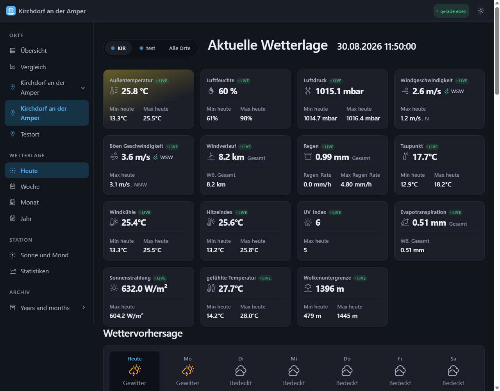
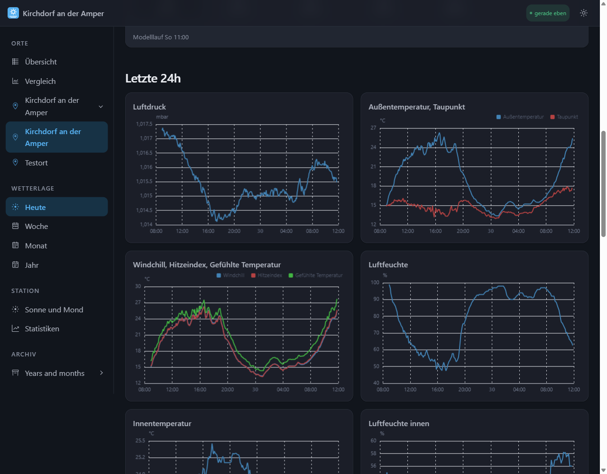
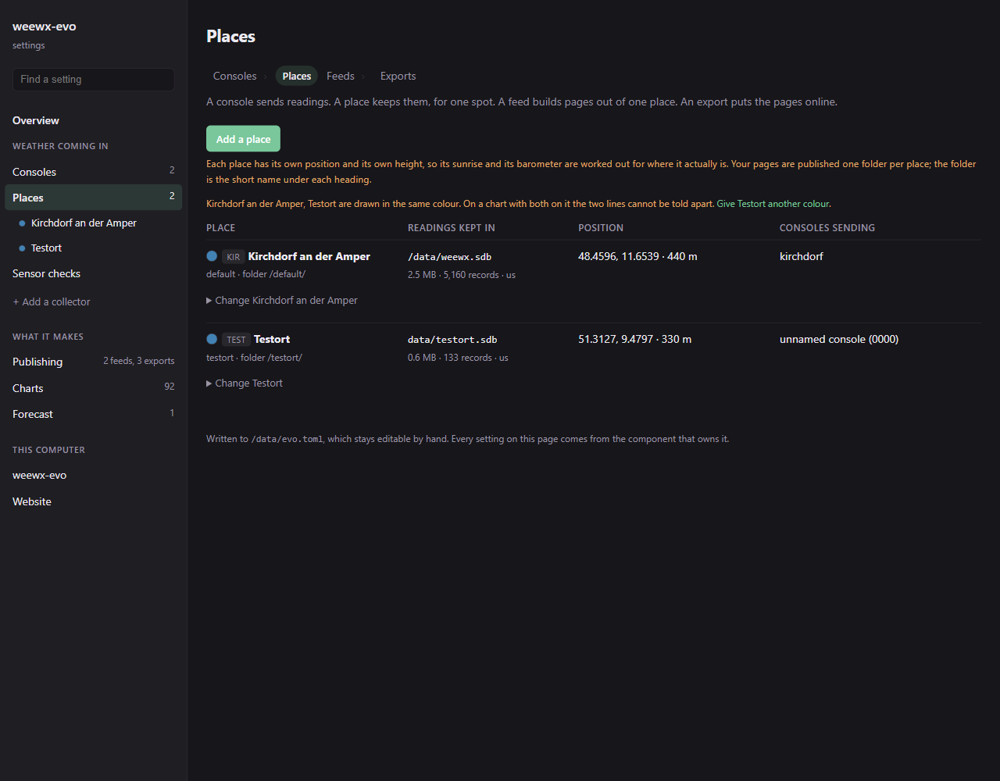

# weewx-evo

**Your weather station, on your own website.** Reads a console you already own,
keeps every reading, and publishes a site you host yourself — no cloud account,
no subscription, nothing that stops working when a company loses interest.

It records the weather at one spot or at twelve, and it goes on using an
existing WeeWX database **without changing it**, so you can try it beside what
you run now and switch back at any point.

**[See a station running it →](https://weewx-evo.formsache.app/default/index.html)**



Every reading gets its own card with today's high and low, live while the
console is sending. Below them, the last 24 hours:



Everything is set from a page in your browser. No file to edit unless you want
to — and the file it writes stays readable and editable by hand:



## What you get

| | |
|---|---|
| **A website** | a full site, in your language, light or dark, on a web host of your own — or on the station itself |
| **Live readings** | on the published page, without a broker, a port forward or a certificate |
| **Charts** | around a hundred to start with, changeable, drawn from your record |
| **A forecast** | Open-Meteo, DWD, MeteoAlarm or the US service, with warnings |
| **Several places** | a garden and an allotment on one site, compared side by side |
| **Weather services** | Weather Underground, Windy, CWOP, PWSweather, WOW, Weathercloud |
| **Home Assistant** | over MQTT, or the built-in HTTP API |
| **Grafana** | your record as dashboards, generated from the charts you already have |
| **Alerts** | an email when a console goes quiet or an upload starts failing |
| **Sensor checks** | a flat battery reporting −40 never reaches the record |

## Will it run my console?

Almost certainly.

**Anything with a *Custom Server* field** posts straight to it — Ecowitt
gateways, Froggit, Sainlogic, Ambient, La Crosse. Six protocols are built in.

**Anything WeeWX supports** runs too: weewx-evo drives any WeeWX driver in a
process of its own, and **WeeWX does not have to be installed**. That covers
Davis Vantage, Fine Offset, SDR receivers and around a hundred others.

## Getting it running

Python 3.11 or newer. Nothing else — no database server, no message broker, no
web server. It runs on a Raspberry Pi.

```bash
git clone https://github.com/hilman2/weewx-evo
cd weewx-evo
pip install -e .
```

A token, your position, and go:

```bash
python -c "import secrets; print(secrets.token_hex(24))"    # your token

weewx-evo config set --config evo.toml token <the-token>
weewx-evo config set --config evo.toml station.name "Kirchdorf an der Amper"
weewx-evo config set --config evo.toml station.latitude 48.4596
weewx-evo config set --config evo.toml station.longitude 11.6539
weewx-evo config set --config evo.toml station.altitude 440

weewx-evo serve --config evo.toml
```

Then point the console at `http://<this-machine>:8000/<token>/ecowitt/` and open
the settings page for everything else.

**[Getting started →](https://github.com/hilman2/weewx-evo/wiki/Getting-Started)**
· [Connecting a console](https://github.com/hilman2/weewx-evo/wiki/Connecting-a-console)
· [Publishing a website](https://github.com/hilman2/weewx-evo/wiki/Publishing-a-website)
· [Running it in Docker](https://github.com/hilman2/weewx-evo/wiki/Deployment)

## Already running WeeWX?

Your database is used as it is. Not imported, not converted: **the same file,
and WeeWX 5 can carry on using it afterwards.** That is the one promise this
project does not negotiate, and most of the test suite exists to hold it — the
daily statistics of a real database are recomputed and compared against what
WeeWX itself wrote.

Your settings and your charts come across too:

```bash
weewx-evo config import /etc/weewx/weewx.conf --config evo.toml --write
weewx-evo plots import /etc/weewx/skins/Seasons/skin.conf --write
```

And a WeeWX skin renders unchanged, so a site you have tuned for years keeps
working. → [WeeWX compatibility](https://github.com/hilman2/weewx-evo/wiki/WeeWX-Compatibility)

## Documentation

The [wiki](https://github.com/hilman2/weewx-evo/wiki) has a user guide — one
page per job, from connecting a console to backups — and, below it, how the
thing is built, for anyone who wants to change the code.

## Licence

**GPL-3.0-or-later.** Parts of this are transcribed from WeeWX expression by
expression — the daily statistics arithmetic and the unit conversions — which
makes it a derived work, and WeeWX is GPL v3.

That is deliberate. A "cleaner" recomputed conversion is a chart that differs
from WeeWX in the third decimal, and not doing that is the whole promise above.

WeeWX: Copyright (c) Tom Keffer and contributors, <https://weewx.com>.

**Bundled:** the [Deck](https://github.com/Daveiano/weewx-wdc) skin (David
Baetge, GPL v3), the [Ecowitt driver](https://github.com/hilman2/weewx-ecowitt),
and [uPlot](https://github.com/leeoniya/uPlot) (MIT) for the diagnostic page.
Nothing else — the core runs on the Python standard library.
