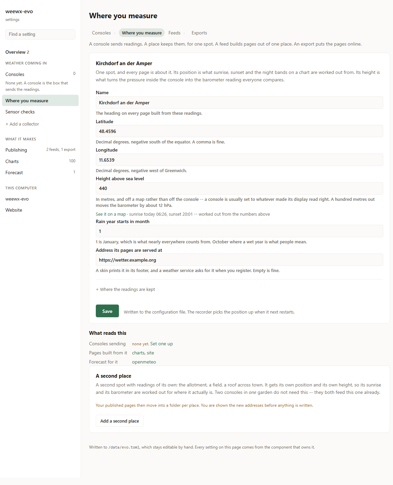
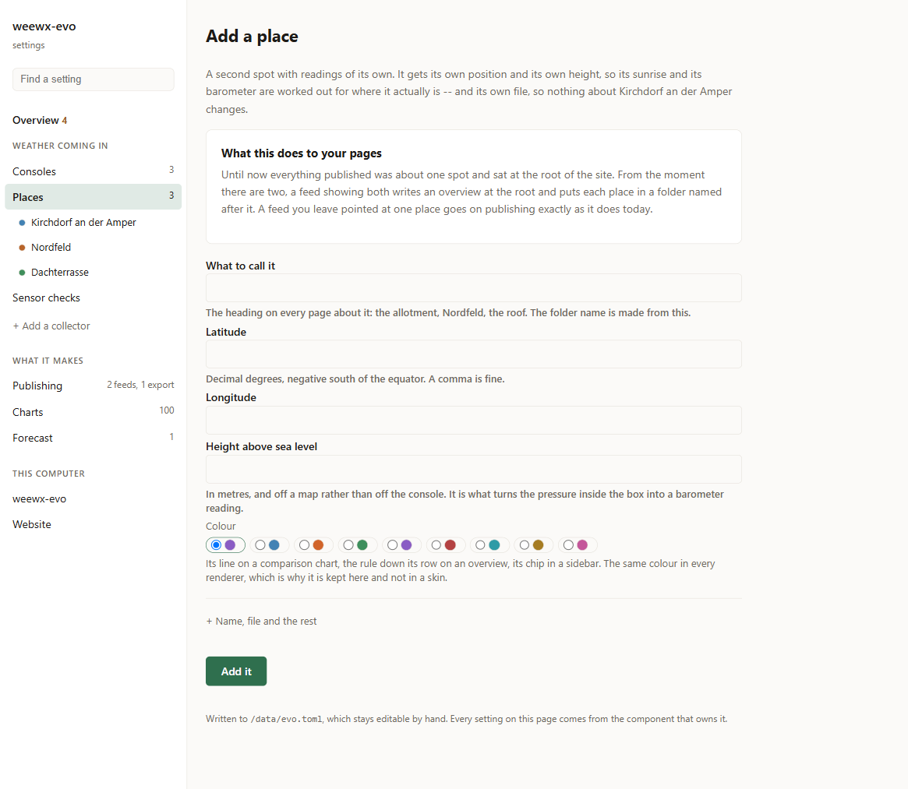
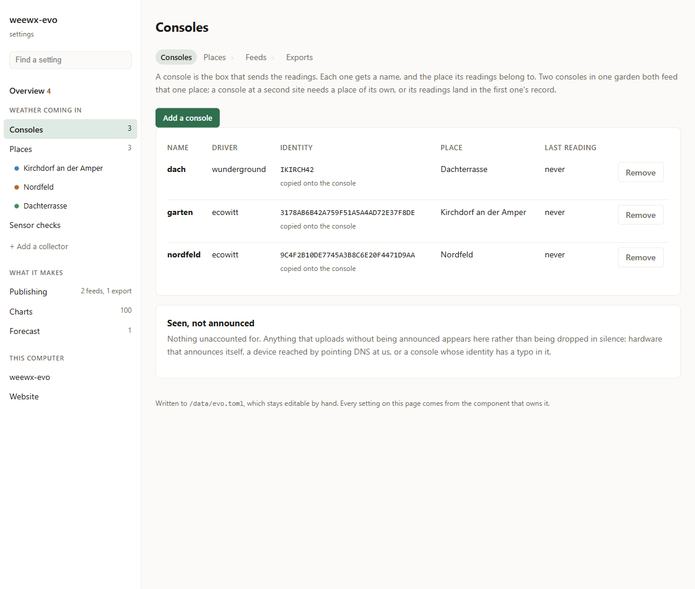
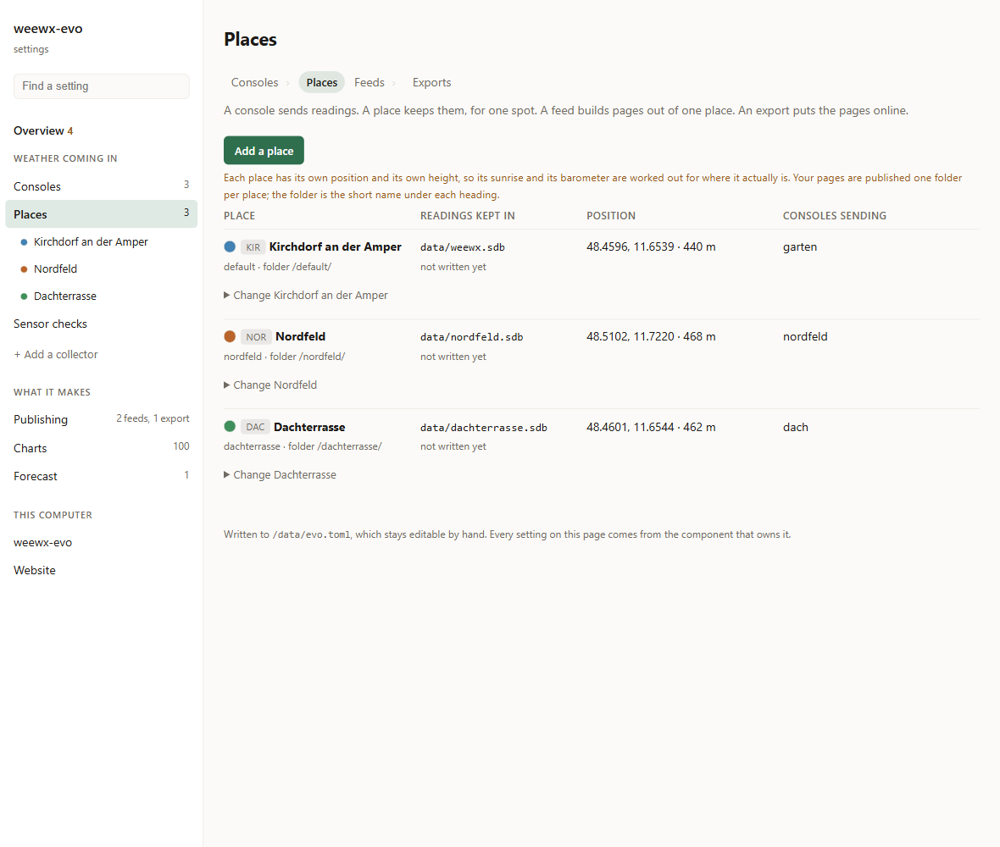
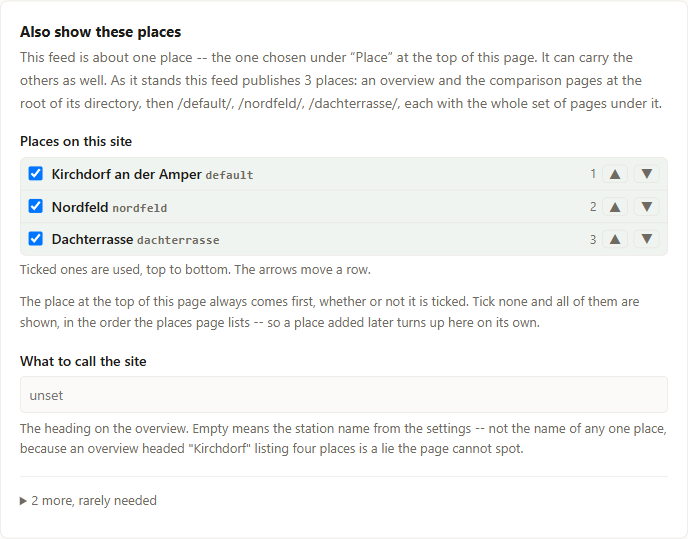

# Several places

Suppose the weather at one spot is no longer the whole story. A second console
goes up at the allotment two kilometres away. A farmer covers twelve fields. Six
people in one district each run a station and want them on one site.

This page is how you get from one place to several, and what changes on your
published pages when you do. For why it is built this way, and for the parts of
it that are not settings, see
[Stations and Archives](Stations-and-Archives).

## What a place is

A **place** is one spot whose weather is kept: its own position, its own height
above sea level, and its own file of readings. Sunrise, sunset and the barometer
reduction are worked out from the position and the height, so each place gets
its own.

Four words, each meaning one thing, everywhere in the settings:

| | |
|---|---|
| **Console** | the box that sends the readings |
| **Place** | one spot they are kept for |
| **Feed** | what builds pages out of one place |
| **Export** | what puts the pages online |

The settings page prints that chain at the top of every page it applies to, with
the one you are on marked.

## Before there is a second one

With one place the settings **are** the place, and the word does not appear. The
page is called **Where you measure** and holds the fields themselves.

Two of those fields are worth getting right, and the page gives you a way to
check them:

* **Position** decides sunrise, sunset and the night bands on a chart. Nobody
  knows whether `48.4596` is correct. Everybody knows whether the sun came up at
  half past six, and the line under the boxes prints today's sunrise and sunset
  worked out from what is in them. A transposed pair or a dropped minus sign
  shows up there and nowhere else.
* **Height above sea level** is what turns the pressure inside the console into
  the barometer reading everyone compares. Take it off a map rather than off the
  console: a console is usually set to whatever made its own display read right.
  A hundred metres out moves the barometer by about 12 hPa.

Under **What reads this** the page lists the consoles sending into it and the
feeds and forecasts built from it, so you can see what depends on the numbers
before you change them.

## Adding a place

Two consoles in *one* garden do not need this. Both already feed the one place,
and pointing a second console at it is a job for the
[Consoles](#pointing-a-console-at-a-place) page. A place is for a second
*spot* -- somewhere with its own sunrise and its own air pressure.

**Where you measure → Add a second place.**

Five things are asked, and only the first is required:

| | |
|---|---|
| **What to call it** | The heading on every page about it. The folder name is made from this |
| **Latitude**, **Longitude** | Decimal degrees. A comma is fine |
| **Height above sea level** | In metres |
| **Colour** | Its line on a comparison chart and its chip in a sidebar |

The folder name, the readings file, a short code, the address and the rain year
are behind **Name, file and the rest**. Each is worked out from what you typed
unless you say otherwise: `Nordfeld` becomes the folder `nordfeld` and the file
`data/nordfeld.sdb`.

### What this does to your pages

Until now everything published was about one spot and sat at the root of the
site. From the moment there are two, a feed showing both writes an overview and
the comparison pages at the root, and puts each place in a folder of its own.
The Add page says so before you press the button, and the feed's own page says
which addresses it will write. → [Publishing to one site](#publishing-several-places-to-one-site)

### The settings move

Adding the second place writes **both** into `archives.toml`, and from that
moment the station name, the coordinates and the height are read from there
rather than from the settings. The System page marks those fields as moved and
links here.

This is the only moment that switch happens. Saving on the **Where you measure**
page before there is a second place writes the settings, not a new file.

## Pointing a console at a place

With one place nothing is filtered: every packet reaches it, whether or not the
console that sent it was ever announced. That is what keeps an installation
working that has never heard of places.

From two places on, each console says which one it writes into. **Consoles →**
the row's **Place**.

A console that has turned up but was never announced appears under **Seen, not
announced**, with its readings already being recorded under whatever identity
its hardware sent. Adopting one gives it a name and a place.

**A place nothing writes into says so** on the Places page, and links to here.
Its pages render and stay empty otherwise, which looks like a broken template
rather than a console nobody pointed anywhere.

## Seeing them all

**Places** lists them: what each is called, where its readings are kept, where
it is, and which consoles send into it.

Two things it will tell you without being asked:

* **Two places drawn in the same colour.** They cannot be told apart on a chart
  with both on it. Said once, naming both, with a link to the one to change.
* **A feed reading a place that is not on the list.** It goes on publishing --
  the default place's readings, under the missing one's name, with every page
  rendering and nothing failing.

### Removing one

A place is taken off the list; its readings file stays where it is. Nothing
else holds what is in it.

**A place a console still writes into is refused.** The console would fall back
to the default, and one spot's readings would be mixed into another's series --
which is the failure all of this exists to prevent. Point the console somewhere
else first.

## Publishing several places to one site

One feed carries all of them. Not one feed per place: two feeds could not link
to each other, and every skin setting would sit in the file N times.

On the feed's page, **Place** at the top is the spot its pages are about.
**Also show these places** further down is everything the site carries.

Every place gets a row. Tick the ones this site shows; the ticked ones are
numbered in the order they will appear, and the arrows move a row. The place
chosen at the top of the page always comes first, whether or not it is ticked.

**Tick none and all of them are shown**, in the order the Places page lists --
so a place added later turns up on the site on its own.

The group's own description prints the addresses this feed will write, worked
out the same way the renderer works them out:

> As it stands this feed publishes 3 places: an overview and the comparison
> pages at the root of its directory, then /default/, /nordfeld/,
> /dachterrasse/, each with the whole set of pages under it.

What that site gets, beyond the pages each place already had:

| | |
|---|---|
| **An overview** | One row per place, one column per reading. Anything unusual is named above it |
| **Comparison pages** | One per period, the places side by side |
| **A place switcher** | In the side panel |

There is no total row anywhere on it. Two thermometers reading 19 and 21 do not
make 20. The only figure spanning places is a **difference**, and it names both
ends.

### Charts and forecasts

A chart line names the place it reads, so one chart can draw two places on one
axis. → [Plots](Plots)

A forecast is an answer about a pair of coordinates, so it belongs to one place:
two places want two entries. A place with no entry gets no forecast -- never its
neighbour's. → [Forecast](Forecast)

## What is not built

A **timezone per place.** The day statistics are keyed on local midnight, so
this is a change to the arithmetic rather than to the configuration. Sites in
different zones stay a real case. → [Stations and Archives](Stations-and-Archives)

<!-- covers
src/weewx_evo/adminarchives.py
src/weewx_evo/adminstations.py
-->
