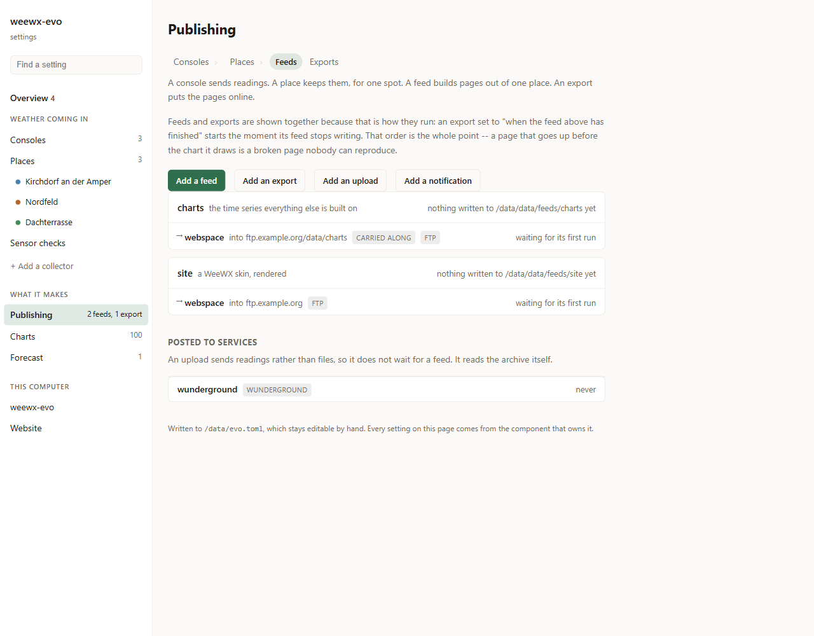
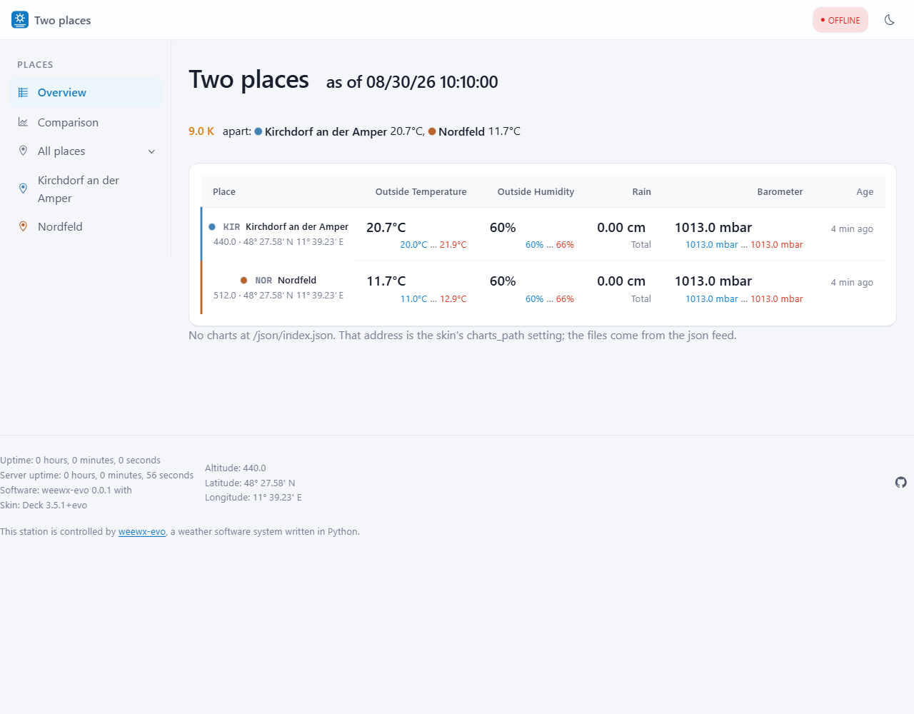

# Publishing a website

From a record in a database to pages somebody can open.

Two things do it, and keeping them apart is what lets one arrangement serve
several:

| | |
|---|---|
| A **feed** builds files into a directory | the pages, the charts, a JSON document |
| An **export** takes that directory somewhere | a web host over FTP, a server over rsync, a folder on this machine |

The directory is the whole interface between them. One feed, three exports. Or
three feeds into one directory and one export. Neither knows about the other.

In WeeWX the FTP upload is configured *inside* the skin's own section, so two
destinations mean running the renderer twice.

## The shortest way to a site

**Publishing → Add a feed**, kind `cheetah`, skin `deck`. That is the whole
setup: Deck ships with weewx-evo and renders a full site.

Then **Add an export**, kind `ftp`, and point it at the feed. It runs when the
feed has finished writing — not on its own clock, so a page never goes up
before the chart it draws.

```toml
feeds.site.kind = "cheetah"
feeds.site.skin = "deck"

exports.webspace.kind = "ftp"
exports.webspace.source = "site"
exports.webspace.host = "ftp.example.org"
```



## The charts are a second feed

Deck draws from JSON files that the `json` feed writes. Both directories have
to go up, or the site arrives with empty charts:

```toml
feeds.charts.kind = "json"
exports.webspace.also = ["charts -> data/json"]
```

`also` rather than a second export: **one export waits for both feeds**, and
nothing can send the pages before the charts they draw.

## What a feed can be

| | |
|---|---|
| `cheetah` | a WeeWX skin, rendered — Deck, or one you already run |
| `json` | the time series everything else is built on |
| `images` | the same charts as PNG |
| `realtime` | small files a page can poll |
| `diagnostic` | draws whatever is actually on disk, and finds fault with it |

→ [Feeds](Feeds), [Deck](Deck), [Exports](Exports)

## Only what changed goes up

rsync works that out itself. FTP cannot — `MDTM` is optional and shared hosting
invents answers — so weewx-evo keeps its own list, and compares small files by
content rather than by timestamp. A template that rewrites `index.html` with
identical bytes every run would otherwise send the whole site every five
minutes. → [Exports](Exports#only-send-what-has-changed)

## Live readings on a published page

A page sent by FTP shows figures as old as the last run. The usual way around
that is an MQTT broker at the station, a port forward and a certificate.

Here it is a checkbox. Every export carries a small PHP file up with it, and
the station posts the current readings into it. The connection goes **out**,
the same way the upload that put the pages there did. Nothing is opened,
nothing expires. → [Uploads](Uploads#live-readings-on-a-published-page)

## More than one place

One feed carries all of them: an overview at the root, comparison pages beside
it, and each place in a folder of its own. → [Several places](Places)



## Checking it

The **Publishing** page shows each feed with the exports carrying it
underneath, and when each last ran. An export that was refused says so there,
with what the far end said — a wrong password found now beats one found in a
log nobody reads.

```bash
weewx-evo export run --once
```

<!-- watches
src/weewx_evo/feeds/
src/weewx_evo/exports/
src/weewx_evo/adminpublish.py
src/weewx_evo/skins/deck/options.py
-->
