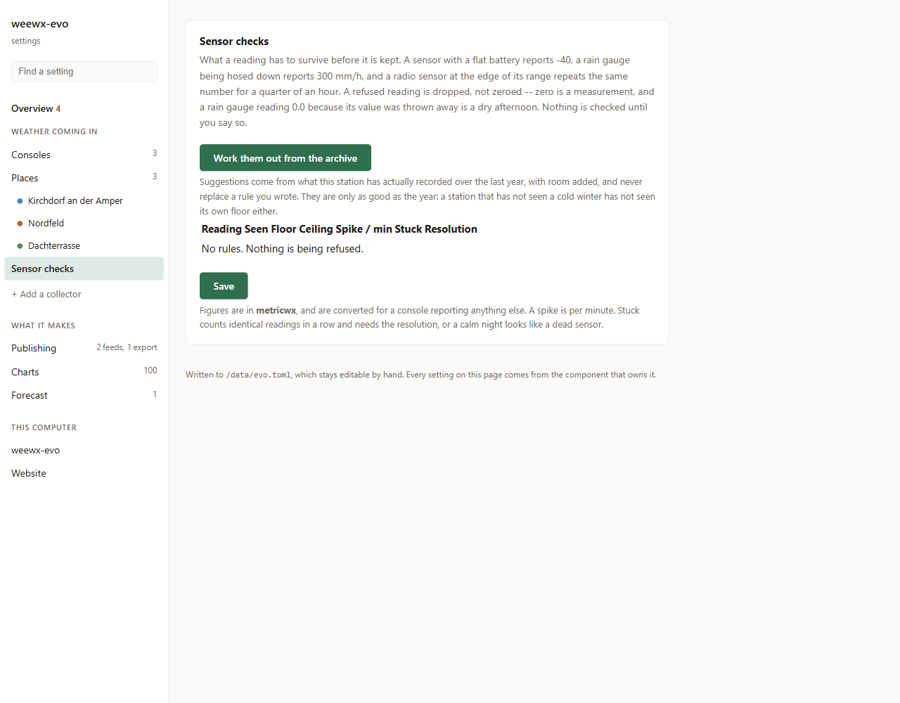

# Sensor checks

Keeping a broken sensor out of the record.

With one console this is a nicety. With ten it is why an archive holds rubbish
after a year:

* a sensor with a flat battery reports −40
* a rain gauge being hosed down reports 300 mm/h
* a radio sensor at the edge of its range repeats one figure for a quarter of
  an hour

All three go into the record, and the record is the one thing here that cannot
be rebuilt from anything else.

**Nothing is checked until you say so.** A limit somebody guessed is worse than
none: it throws away real weather on the one day it mattered.

## Working the limits out

Nobody can type a plausible ceiling for `soilMoist3` out of their head, so the
station is measured instead. **Sensor checks → Work them out from the
archive.**

```bash
weewx-evo quality suggest --days 365 > quality.toml
```

It reads the archive for floors and ceilings, because that has years and knows
how cold it gets here, and the live table for the spike and stuck rules,
because only that has the packet-to-packet steps those are about.

It knows three things the data does not say: what is physically possible
(four years of readings otherwise suggest −2 m/s of wind and 114 % humidity),
which quantities wrap around, and that a resolution is small against a range.

## Before it takes effect

The page prints **what the rules as they stand would have refused**, over the
history you already have, before anything is saved. A rule that would have
thrown away a real storm shows up there rather than in six months.

```bash
weewx-evo quality check
```



## A refused reading is dropped, not zeroed

Zero is a measurement. A rain gauge reporting 0.0 because its value was thrown
away is indistinguishable from a dry afternoon, and no page can tell the
difference afterwards.

## It is reversible

The checks run in the archiver, on the way from the live table into the
record — **not** on the way in. The raw packet is kept either way. So a limit
set too tight is repairable for as long as retention holds: change the rule,
`weewx-evo rebuild`, done. Applied on the way in, the original would be gone
and the mistake permanent.

Where a reading is *written* now follows the same rule and for the same reason
→ [Placements](Placements).

One thing that comes with it, worth knowing before it surprises you: a guess
about a reading no catalog knows is re-read on every rebuild. A later version
with a better inferrer can therefore place such a reading differently from the
first run. That is the point — a wrong guess is repairable for as long as the
retention holds, exactly like a limit — but it means a rebuild is not always a
byte-for-byte replay of what was built before.

→ [Quality control](Quality)

## Calibration

The same page carries offsets: a thermometer reading 0.4 K high, a barometer
that was never adjusted for its height. Calibration happens **before** the
limits, or a thermometer with an offset fails at its own ceiling.

Sender-specific offsets use the canonical Sender ID, not its display name.

<!-- watches
src/weewx_evo/quality.py
src/weewx_evo/adminquality.py
-->
